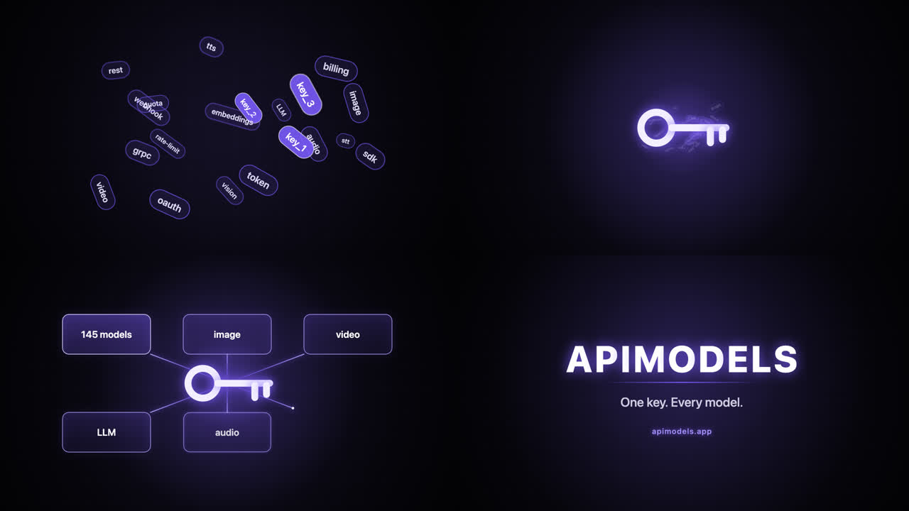

# Our own run: a 12-second promo written by Claude Opus 5.5

English below · [中文在后](#中文)

One API call to `claude-opus-5-5` through [apimodels.app](https://apimodels.app) on 30 September 2026, rendered locally with headless Chrome and FFmpeg. Everything in this folder is from that run: the prompt we sent, the HTML exactly as the model returned it, and the scripts we used.

| | |
| --- | --- |
| Model | `claude-opus-5-5` |
| First token / total time | 110 s / 6 min 37 s |
| Output tokens | 31,786 (mostly thinking) for about 16,000 characters of HTML |
| Billed | $0.368 on apimodels.app ($2.40 / $12 per 1M tokens; exact amount from GET /v1/records/{id}) |
| Render | 360 frames in 14 s on a laptop |
| Result | 12 s, 1280x720, 30 fps, 1.8 MB MP4 |

## Steps

1. `prompt.md` asks for a program with a frame contract: one HTML file exposing `window.renderFrame(t)` that draws frame t from scratch, with no clock, randomness or state between calls.
2. `call.sh` streams the request (Opus 5.5 thinks for about two minutes before the first character; a short client timeout will give up). It sends no `max_tokens`: a small cap cuts the file off mid-script.
3. `node join.mjs` joins the streamed text into `promo.html`. Open it in a browser first; it plays its own preview loop. Our copy is in this folder.
4. `node render.mjs` (needs `puppeteer-core` and a local Chrome or Chromium) calls `renderFrame(i / 30)` for every frame and saves PNGs.
5. `bash encode.sh` encodes the frames to H.264 with `yuv420p` and `faststart`.

Limits we hit: no audio (add it afterwards with FFmpeg), a slow first token, and the model never runs its own page, so render it and look at the frames before trusting it.

## 中文

2026 年 9 月 30 日,通过 [apimodels.app](https://apimodels.app) 调用一次 `claude-opus-5-5`,再在本机用无头 Chrome 和 FFmpeg 渲染。这个目录里的东西全部来自那次运行:我们发出的提示词、模型原样返回的 HTML,以及用到的脚本。

| | |
| --- | --- |
| 模型 | `claude-opus-5-5` |
| 首字 / 总耗时 | 110 秒 / 6 分 37 秒 |
| 输出 token | 31,786(大部分是思考),换来约 16,000 字符的 HTML |
| 实扣 | $0.368(apimodels.app,每百万 token $2.40 / $12;准确金额可用 GET /v1/records/{id} 查) |
| 渲染 | 360 帧,笔记本上 14 秒 |
| 成片 | 12 秒、1280x720、30fps、1.8 MB MP4 |

步骤:`prompt.md` 要的是「带帧协议的程序」(暴露 `window.renderFrame(t)`,每帧只由 t 决定)→ `call.sh` 流式调用、不传小的 `max_tokens` → `node join.mjs` 拼出 `promo.html` → `node render.mjs` 逐帧截图 → `bash encode.sh` 编码。遇到的限制:没有声音(用 FFmpeg 后期合)、首字慢、模型不会自己运行页面,输出要当未经测试的代码,渲染并看过关键帧再用。

These files are ours and licensed under CC BY 4.0 (see [LICENSE](../LICENSE)). · 本目录内容由我们创作,按 CC BY 4.0 授权。
